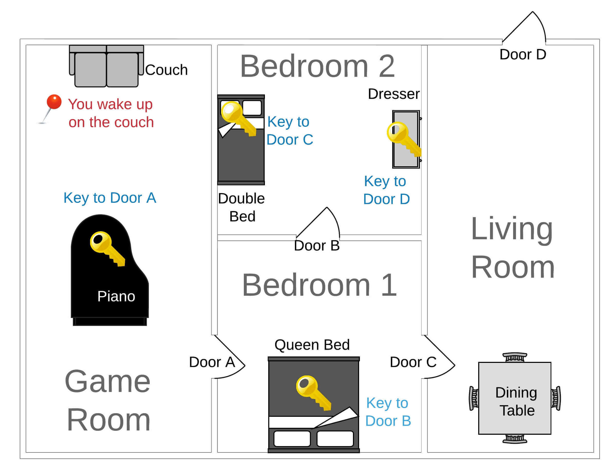

# 🧩 Escape Room - Week 1

Welcome to the **Escape Room Week 1** project! This repository contains beginner-level programming puzzles designed to test your logical thinking, Python programming fundamentals, and problem-solving skills in a fun and engaging way.

---

## Game Design
Quest Brief
Your team will develop the "Escape Room" game. Implement Python code, manage errors, and test your game to ensure robustness. Each room presents unique challenges. The goal is to escape from the starting room (Game Room) to the end (Outside). Look at the image below and read the game narrative to understand the game logic fully:



## 📌 Project Overview

The Escape Room challenges are structured as sequential Python puzzles. Each puzzle builds upon your understanding of data types, control flow, string manipulation, and logical reasoning. The goal is to "escape" each level by solving a coding task correctly.

This project is perfect for:
- Beginner Python programmers
- Students learning logic and control flow
- Anyone looking for a fun way to brush up their coding skills

---

## 🛠️ Installation

### Requirements
- Python 3.7 or above
- Jupyter Notebook (recommended for interactive use)

### Setup Instructions

1. Clone the repository:
   ```bash
   git clone https://github.com/samyak-anand/Escape_Room_Week1.git
   cd Escape_Room_Week1


python -m venv env
source env/bin/activate  # or `env\Scripts\activate` on Windows
